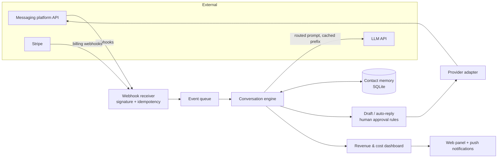

# Conversational AI CRM — case study

> **ES:** Caso de estudio de un CRM SaaS multi-tenant con IA conversacional que diseñé, construí y opero
> en producción como desarrollador único. El código del producto es privado; aquí explico la
> arquitectura y las decisiones, y publico tres piezas reescritas desde cero para mostrar cómo resolví
> los problemas difíciles.

A multi-tenant SaaS CRM for the creator economy: it manages each creator's audience, drafts
replies with an LLM in the creator's own voice, remembers every contact, segments customers,
handles subscription billing and reports revenue. I designed, built, deployed and run it alone.

**The product code is private.** This repository documents the architecture and the decisions,
and contains three small, self-contained examples **written from scratch for this repo** (no
product code, no customer data) that show how the hard parts were solved.

## In numbers

| | |
|---|---|
| Role | Sole architect and developer, end to end |
| First production version | about one month after the first line of code |
| Codebase today | ~45,000 lines of Python in 110 files, 150+ commits |
| Automated checks | 600+ checks run before every deploy; nothing ships with one red |
| Stack | Python (standard library first), SQLite, Anthropic Claude API, REST integrations, Stripe, Web Push (VAPID), webhooks, Linux VPS + systemd |

## Architecture



## Decisions worth explaining

**1. Choose the model by measured cost, not by habit.** Every LLM task has a tier (classify an
intent, draft a reply, summarise a history). Each task goes to the cheapest model that passes a
quality check for that task, and the real cost of every message is recorded per tenant.
→ [`examples/cost_control.py`](examples/cost_control.py)

**2. Prompt caching by design.** Prompts are ordered stable → per-contact → volatile: the brand
voice and rules (thousands of tokens, identical on every call) come first and are cached by the
provider; only the tail changes. In the example numbers that is about two thirds cheaper per message.

**3. A swappable provider layer.** The application talks to one small interface; each external
platform is an adapter. When the upstream API changed, I wrote a new adapter and the rest of the
app did not change. → [`examples/provider.py`](examples/provider.py)

**4. Webhooks you can trust.** HMAC signature over the raw body, a timestamp window against
replays, and idempotency by event id because providers retry.
→ [`examples/webhooks.py`](examples/webhooks.py)

**5. AI with guardrails.** Hard business rules live in code, not in the prompt: what may be sent
automatically, what needs a human, spending limits per tenant, and nothing is sent to real
customers from a test.

**6. Boring, reliable operations.** Standard library first, SQLite, one VPS with systemd,
compressed backups before every deploy, a deploy that refuses to restart if a single check fails,
and a one-command rollback.

## Run the examples

```bash
python -m unittest discover -s tests -t .   # 7 tests, offline, no API keys
python examples/cost_control.py             # cost with and without prompt caching
WEBHOOK_SECRET=dev python examples/webhooks.py
```

Python 3.10+, no dependencies.

## Author

Alejandro Fernández Urbano — Mechatronics engineer, Power Platform & AI automation.
[LinkedIn](https://www.linkedin.com/in/alejandro-fernandez-urbano) · alejandrofernandezurbano@gmail.com
